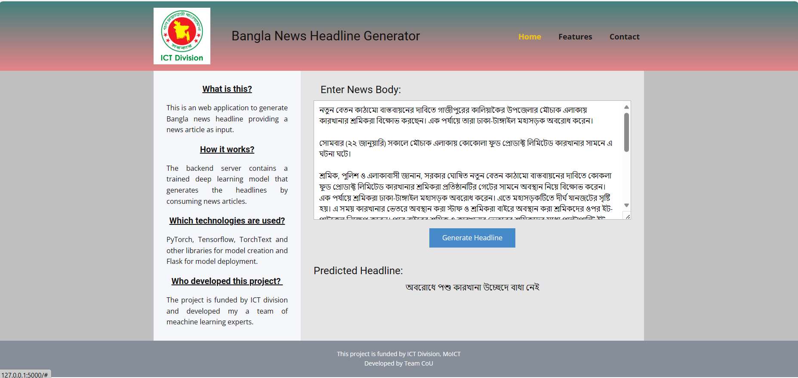
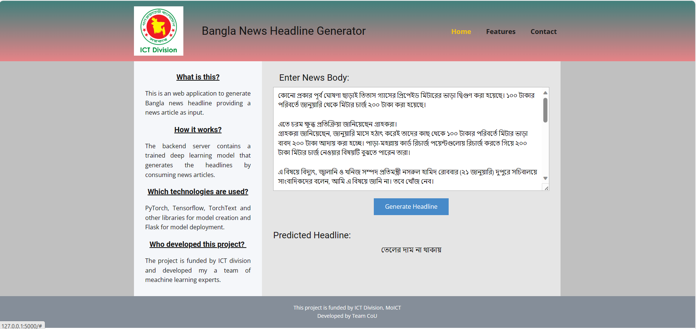
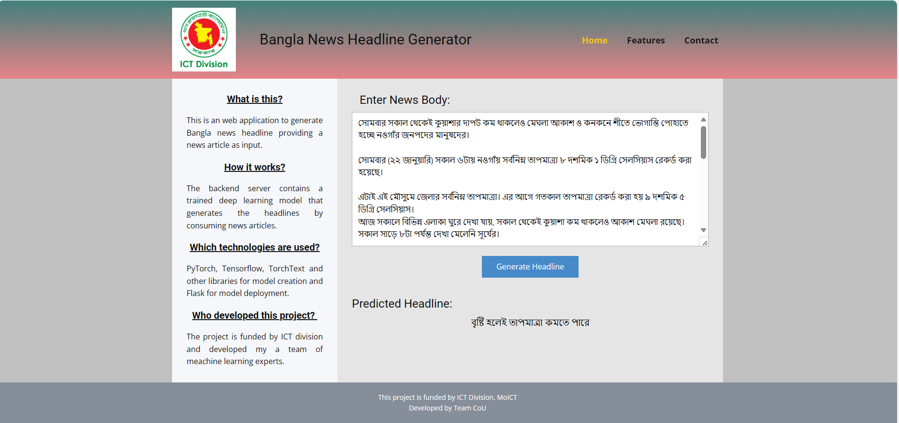
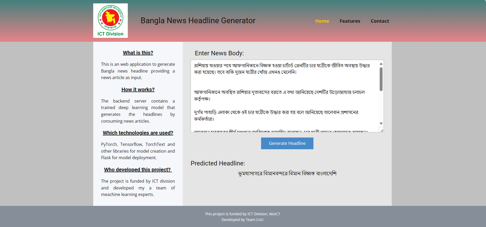
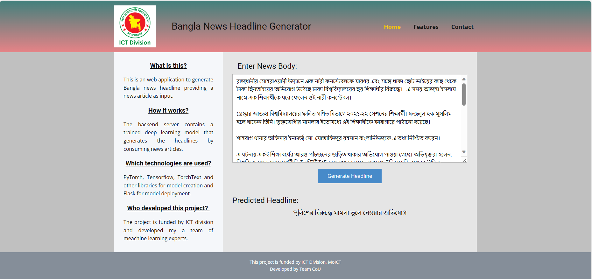

# Run Locally 

1. Download and install Miniconda from the link: https://docs.conda.io/en/latest/miniconda.html
2. Open Anaconda Prompt (miniconda3) from Start Menu
3. Change the directory to current folder. Type: `cd /to/current/directory/`
4. Create a new virtual environment with required packages and dependencies. Type: `conda env create --file environment.yml`
5. Activate the newly created virtual environment. Type: `activate ictd`
6. Set the flask server in development mode. Type: `set FLASK_ENV=development`
7. Start the flask server. Type: `flask run`
8. Keep the window running and open a browser. Visit: http://127.0.0.1:5000/
9. The site will run. Input a news body on the box and click Generate Headline button

# Run Codespaces

1. Go to https://github.com/codespaces and create codespaces with this repository.
2. In the terminal type `pip install flask torchtext==0.6.0`
3. Set the flask server in development mode. Type: `set FLASK_ENV=development`
4. Start the flask server. Type: `flask run`
5. From the terminal end, click http://127.0.0.1:5000/ and it will launch the app in new window
6. Input a news body on the box and click Generate Headline button

# Sample Snapshots

